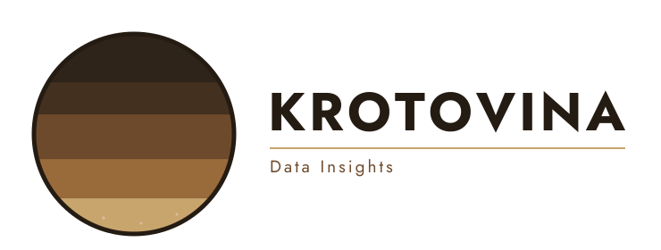

::: {.text-center style="margin-top: 4rem; margin-bottom: 3rem;"}
{fig-alt="Krotovina Data Insights" width=640}

Quantitative soil, carbon, and environmental analysis for carbon
markets, climate risk, and agricultural sustainability.
:::